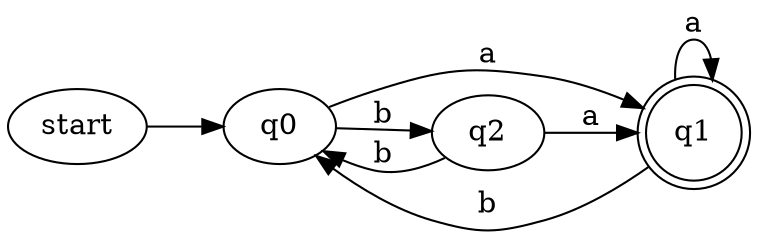

# Fondamenti dell'Informatica

## Automi a stati finiti (FSA-Finite State Automaton)

> [!NOTE]
> Cose’ un automa a stati finiti?\
> E’ un modello matematico di un sistema avente input, ed eventualmente output, a valori discreti.

Esempio Ascensore:
L’input e’ la sequenza di tasti premuti, mentre lo stato e’ il piano in cui si trova.

>[!IMPORTANT]
>Un automa viene rappresentato come una testina che legge da un nastro.
>Questo contiene la sequenza di simboli dell’alfabeto dati in input all’automa.
>Quando la lettura dei simboli termina, a seconda dello stato raggiunto dalla testina, l’automa
>fornisce un risultato di accettazione o di refutazione della stringa letta. Il comportamento
>dell’automa si definisce mediante una tabella, detta matrice di transizione.

### Matrice di transizione

| |a|b|
|---|---|---|
|q0|q1|q2
|q1|q1|q0
|q2|q1|q0

>Codice dot del grafico realizzato con Graphviz

## Automi deterministici (DFA-Deterministic Finite Automaton)

>[!IMPORTANT]
> Un automa a stati finiti deterministico e’ una quintupla $\langle Q,\Sigma,\delta,q_0, F \rangle$ dove:
> - $Q$ e’ un insieme finito di stati;
> - $\Sigma$ e’ un alfabeto finito di input;
> - $\delta$: $Q\times\Sigma\longrightarrow Q$ e’ la funzione di transizione che dato lo stato $q\in Q$ in cui si trova la macchina ed un simbolo $a\in \Sigma$ in lettura del nastro, produce il prossimo stato $\delta(q,a)\in Q$ in cui si trovera’ la macchina;
> - $q_0$ e’ lo stato iniziale;
> - $F\subseteq Q$ e’ l’insieme degli *stati finali*, detti anche *stati di accettazione*
